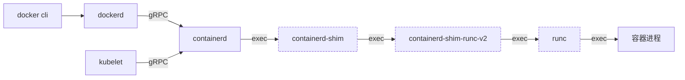

# Kubernetes 模块架构

```text
+-----------------------------------------------------+
|                     Kubernetes Cluster              |
|                                                     |
|  +------------------+      +--------------------+   |
|  |   Master Node    |      |    Worker Node(s)   |  |
|  |                  |      |                     |  |
|  |  +------------+  |      |  +---------------+  |  |
|  |  | API Server |<--------->| Kubelet         | |  |
|  |  +------------+  |      |  +---------------+  |  |
|  |                  |      |                     |  |
|  |  +------------+  |      |  +---------------+  |  |
|  |  | Controller |  |      |  |  Container     | |  |
|  |  | Manager    |  |      |  |  Runtime       | |  |
|  |  +------------+  |      |  +---------------+  |  |
|  |                  |      |                     |  |
|  |  +------------+  |      +--------------------+   |
|  |  | Scheduler  |  |                               |
|  |  +------------+  |                               |
|  |                  |                               |
|  |  +------------+  |                               |
|  |  | etcd       |  |                               |
|  |  +------------+  |                               |
|  +------------------+                               |
|                                                     |
|  +------------------+                               |
|  | Add-ons          |                               |
|  |  - DNS           |                               |
|  |  - Dashboard     |                               |
|  |  - Network Plugin|                               |
|  +------------------+                               |
+-----------------------------------------------------+
```
Master Node：负责集群的管理和控制，包含 API Server、Controller Manager、Scheduler 和 etcd（分布式键值存储）。
Worker Node：负责运行容器化应用，包含 Kubelet（节点代理）、容器运行时（如 containerd、Docker）等。
Add-ons：集群附加组件，如 DNS 服务、Dashboard、网络插件等。

# Kubernetes 组件

 - API Server：负责提供 Kubernetes API 服务，包括创建、更新、删除、查询等操作。
 - Controller Manager：负责管理控制器，包括节点控制器、副本控制器、服务控制器等。
 - Scheduler：负责调度 Pod 到合适的节点上。
 - Kubelet：负责管理节点上的容器化应用，包括启动、停止、重启等操作。
 - Container Runtime：负责管理容器，包括启动、停止、重启等操作。
 - etcd：分布式键值存储，用于存储 Kubernetes 集群的状态信息。
 - Add-ons：集群附加组件，如 DNS 服务、Dashboard、网络插件等。
 - Kube-proxy：负责实现 Kubernetes 服务发现和负载均衡，将服务请求路由到正确的 Pod。
 - CNI（Container Network Interface）：负责为容器提供网络功能，如创建网络命名空间、配置 IP 地址、路由表等。
 - Kube-dns：负责为 Kubernetes 集群中的服务提供 DNS 解析服务。
 - Ingress Controller：负责处理外部流量进入集群的流量路由和负载均衡。
 - Dashboard：提供 Web 界面，用于可视化管理和监控 Kubernetes 集群。
 - Logging and Monitoring：负责收集和分析容器的日志，提供监控和报警功能。
 - Helm：用于管理 Kubernetes 应用的包管理器，类似于 Linux 系统中的 apt 或 yum。
 - Prometheus：用于监控和报警，提供指标收集和查询功能。
 - Grafana：用于可视化监控数据，支持多种数据源，如 Prometheus、InfluxDB 等。

# k8s 常见资源类型
- Pod
Pod也叫容器组，是Kubernetes中最小的可部署单元，它是一个或多个相关容器的组合。Pod中的容器共享网络和存储资源，并在同一主机上运行。Pod由Kubernetes调度器分配给节点，并使用Linux命名空间和cgroups来隔离容器。

- Deployment
Deployment用于管理无状态Pod的创建和更新。它通过控制器模式（ReplicaSet）来确保指定数量的Pod副本在集群中运行。当需要进行扩展、回滚或更新时，Deployment会创建新的Pod，并逐步替换旧的Pod。

- Service
Service提供了一种稳定的网络访问方式，用于暴露Pod或一组Pod的网络服务。Service通过标签选择器（Label Selector）将请求路由到后端Pod。它使用Kubernetes的服务发现机制，通过集群内部的DNS或负载均衡器将请求转发到正确的Pod。

- Ingress
Ingress是一种规则集合，用于将外部请求路由到集群内部的Service。它充当了集群外部和集群内部之间的入口点。Ingress控制器根据Ingress规则将请求转发到相应的Service，并处理负载均衡、SSL终止和路径匹配等功能。

- ConfigMap
ConfigMap用于存储应用程序的配置数据，如环境变量、配置文件等。它将配置数据存储为键值对，并将其注入到Pod的容器中。容器可以通过环境变量或挂载文件的方式访问ConfigMap中的配置数据。

- Secret
Secret用于存储敏感数据，如密码、令牌等。读取Secret时默认以Base64编码的形式从 etcd 中取出，并可以被Pod中的容器使用。Secret可以用于安全地传递敏感信息，如数据库密码或API密钥，需要注意的是 k8s 并不默认提供对 secrets 的加密，需要自己实现密钥管理服务（Key Management Service，KMS）。


# pod 创建过程
创建 pod 的流程大致如下：
1. 当执行 kubectl create deploy 时，k8s 执行的流程如下：
2. kubectl 执行客户端校验，资源类型、镜像名称等
3. Kubectl 读取.kube/config获取认证信息，kube-apiserver 地址
4. kubectl 生成请求内容并往 apiserver 发送创建请求
5. kube-apiserver 通过认证和鉴权后将信息存储至 etcd
6. kube-controller-manager监听到 deploy create events，检查相关资源是否已经存在
7. Deployment controller 创建 ReplicaSets，replicaset controller 创建 pods，存入 etcd，pod 进入 pending 状态
8. kube-scheduler监听到 pod 未分配节点，开始选择合适的节点，发送 POST 请求给 apiserver
9. kube-apiserver 将 pod 状态标记为 scheduled
10. kubelet 轮询 kube-apiserver 获取 pod 信息，开始创建 cgroup，创建数据目录，调用 CRI （container runtime interface）创建 container
11. 创建 pause 容器，kubelet 通过 CNI（container network interface）创建网络
12. kubelet 从镜像仓库拉取pod 的镜像，通过 CRI 插件创建 container
 以上仅是对关键步骤的简要描述，实际情况要复杂得多。

docker、containerd、runc 是什么关系？
containerd、runc 由 docker 拆分出来，runc 是一个标准的OCI runtime实现，containerd 支持多种OCI runtime 实现，对应 runc 的支持提供了 containerd-shim-runc-v2,一个容器的创建具体过程如下：




 k8s v1.19版本，kubelet 使用 docker-shim与 dockerd 通信，k8s自 v1.20版本开始建议使用 containerd-shim，1.24 版本彻底废弃 docker-shim。

# Canal
Canal 是一个 CNI 网络插件，它很好地结合了 Flannel 和 Calico 的优点。它让你轻松地将 Calico 和 Flannel 网络部署为统一的网络解决方案，将 Calico 的网络策略执行与 Calico（未封装）和 Flannel（封装）丰富的网络连接选项结合起来。
Canal 是 Rancher 默认的 CNI 网络插件，并采用了 Flannel 和 VXLAN 封装。
CNI（容器网络接口）是一个云原生计算基金会项目，它包含了一些规范和库，用于编写在 Linux 容器中配置网络接口的一系列插件。CNI 只关注容器的网络连接，并在容器被删除时移除所分配的资源。
Kubernetes 使用 CNI 作为网络提供商和 Kubernetes Pod 网络之间的接口。
Canal 架构
Flannel 是为 Kubernetes 配置 L3 网络结构的简单方法。Flannel 在每台主机上运行一个名为 flanneld 的二进制 Agent，该 Agent 负责从更大的预配置地址空间中为每台主机分配子网租约。Flannel 通过 Kubernetes API 或直接使用 etcd 来存储网络配置、分配的子网、以及其他辅助数据（例如主机的公共 IP）。数据包使用某种后端机制来转发，默认封装为 VXLAN。

```text
+-------------------------------------------------------------+
|                         Master Node                         |
|                                                             |
|  +-----------+     +-----------+       +----------------+   |
|  | Kubelet   | --> | Scheduler |       | Controller     |   |
|  +-----------+     +-----------+       | Manager        |   |
|           \            |               +----------------+   |
|            \           |                      |              |
|             \          |                      |              |
|              \         |                      v              |
|               \        +-----------------> API Server <------+ <-- kubectl
|                \                       /     ^       ^       |
|                 \                     /      |       |       |
|                  \                   /       |       |       |
|                   \                 /        |       |       |
|                    \               /         |       |       |
|                     v             v          |       |       |
|                    etcd <---------+          |       |       |
|                      ^                         |       |       |
|                      |                         |       |       |
|                   Proxy <---------------------+       |       |
|                      |                                 |       |
+-------------------------------------------------------------+
+-------------------------------------------------------------+
|                        Worker Nodes                         |
|                                                             |
|  +-----------+     +-----------+       +----------------+   |
|  | Kubelet   | --> | Proxy     |       | Flannel        |   |
|  +-----------+     +-----------+       +----------------+   |
|       |                |                     |              |
|       v                |                     |              |
|    Docker             <---------------------+              |
|       |                                              10.0.0.0/8 (Flannel 网络)  |
|       v                                                         |
|    PODs ------------------------------------------------------> PODs  |
+-------------------------------------------------------------+
```
说明：
- Master Node 负责集群管理，包括 Kubelet、Scheduler、Controller Manager、API Server、etcd 和 Proxy。
- Worker Nodes 运行应用容器，包含 Kubelet、Proxy、Docker 和 POD。
- Flannel 负责跨节点网络通信，使用 10.0.0.0/8 网段。
- kubectl 通过 API Server 与集群交互。
- 流量（traffic）在 Proxy 之间传递。

# pod网络通信
 pod 是如何与外部通信的？

CNI 插件为每个节点分配一个/24网段，例如10.42.0.0/24 10.42.1.0/24，每个 pod 分配一个该节点持有网段的 ip 地址；每个 pod 内有一个 eth0 虚拟网卡，同时宿主机中有与其配对的另外一个虚拟网卡，二者同属一个 network namespace，这种成对出现的网卡叫veth pair，两者可以相互通信，就好比有一根网线一头连接你的电脑网卡，另一头连接交换机。以下面 pod 举例说明：
```text
[k8s@k8s-192-168-4-88 ~]$ kubectl -n k8s get pod -owide | grep 192.168.4.88
k8s-xxx-648c86cd45-qbhj9      1/1     Running   0          43d       10.42.4.15     192.168.4.88
[k8s@k8s-192-168-4-88 ~]$
```

节点上查看 pod 对应的 container 如下，与这个 pod 有关的 container 有两个，一个是业务进程本身，一个是/pause进程,查看 pod 内的网卡如下：
```text
[k8s@k8s-192-168-4-88 ~]$ kubectl -n k8s exec k8s-xxx-648c86cd45-qbhj9 -- ip a
1: lo: <LOOPBACK,UP,LOWER_UP> mtu 65536 qdisc noqueue state UNKNOWN qlen 1000
    link/loopback 00:00:00:00:00:00 brd 00:00:00:00:00:00
    inet 127.0.0.1/8 scope host lo
       valid_lft forever preferred_lft forever
3: eth0@if52: <BROADCAST,MULTICAST,UP,LOWER_UP,M-DOWN> mtu 1450 qdisc noqueue state UP
    link/ether be:67:6a:d4:65:98 brd ff:ff:ff:ff:ff:ff
    inet 10.42.4.15/32 brd 10.42.4.15 scope global eth0
       valid_lft forever preferred_lft forever
```

宿主机上的peer veth 如下：
```text
[k8s@k8s-192-168-4-88 ~]$ ip l | grep ^52:
52: cali18e95c70453@if3: <BROADCAST,MULTICAST,UP,LOWER_UP> mtu 1450 qdisc noqueue state UP mode DEFAULT group default
```

可以看到 pod 中的网卡名，他有固定的命名规则，带了对端网卡的 index 编号 52，在宿主机上查看 index 编号为 52 的网卡名为cali18e95c70453， pod 的网络包收发都会经过宿主机上的cali18e95c70453网卡，可以抓包验证一下：

```text
[k8s@k8s-192-168-4-88 ~]$ kubectl -n k8s exec -it k8s-xxx-648c86cd45-qbhj9 -- curl xxx.com
<html>
<head><title>301 Moved Permanently</title></head>
<body>
<center><h1>301 Moved Permanently</h1></center>
<hr><center>TLB</center>
</body>
</html>
[k8s@k8s-192-168-4-88 ~]$
[k8s@k8s-192-168-4-88 ~]$ sudo tcpdump -nnpA -i cali18e95c70453 tcp dst port 80
tcpdump: verbose output suppressed, use -v or -vv for full protocol decode
listening on cali18e95c70453, link-type EN10MB (Ethernet), capture size 262144 bytes
15:59:43.723438 IP 10.42.4.15.49848 > 122.14.236.25.80: Flags [S], seq 2904204625, win 28200, options [mss 1410,sackOK,TS val 3
E...<.M@.@..
*..z.......P...Q.......n(t.........
..U........
15:59:43.750376 IP 10.42.4.15.49848 > 122.14.236.25.80: Flags [.], ack 3650196656, win 221, options [nop,nop,TS val 3808777527
E..4.N@.@...
*..z.......P...R.......t.......
..U7{...
15:59:43.750434 IP 10.42.4.15.49848 > 122.14.236.25.80: Flags [P.], seq 0:77, ack 1, win 221, options [nop,nop,TS val 380877752
E....O@.@...
*..z.......P...R.......t.......
..U7{...GET / HTTP/1.1
Host: xxx.com
User-Agent: curl/8.5.0
Accept: */*
```

 pod 与 pod 之间是如何通信的呢？首先宿主机的路由表如下：
```text
default via 192.168.4.1 dev eth0
10.42.0.0/24 via 10.42.0.0 dev flannel.1 onlink
10.42.1.0/24 via 10.42.1.0 dev flannel.1 onlink
10.42.2.0/24 via 10.42.2.0 dev flannel.1 onlink
10.42.3.0/24 via 10.42.3.0 dev flannel.1 onlink
10.42.5.0/24 via 10.42.5.0 dev flannel.1 onlink
10.42.4.15 dev cali18e95c70453 scope link 
169.254.0.0/16 dev eth0 scope link metric 1002
172.17.0.0/16 dev docker0 proto kernel scope link src 172.17.0.1
192.168.4.0/24 dev eth0 proto kernel scope link src 192.168.4.88
```

可以看到和其他宿主机的 pod  ip 段是通过flannel.1网卡发送，再看一下邻居表：
```text
10.42.2.0 dev flannel.1 lladdr 62:6d:e7:6f:f3:e9 PERMANENT
10.42.1.0 dev flannel.1 lladdr 9a:b6:27:23:b2:21 PERMANENT
10.42.0.0 dev flannel.1 lladdr a6:eb:6d:4e:48:3a PERMANENT
10.42.3.0 dev flannel.1 lladdr 16:8e:4f:5c:1e:63 PERMANENT
10.42.5.0 dev flannel.1 lladdr 0a:14:55:b6:2e:97 PERMANENT
```

由此可知当发送往其他节点pod的数据包到达flannel.1网卡时，每个网段都对应有一条目标 mac 地址，而这些 mac 地址就是每个宿主机节点上 flannel.1网卡的 mac。
另外需要注意的是上面 pod 的 container 中有一个启动了/pause进程的 container，又叫 infra container 基础容器，他的镜像由 kubelet 指定：
```text
kubelet --infra-container-image=k8s.gcr.io/pause:3.2
```

Infra container的作用是实现 pod 内多个容器之间的存储、网络等资源的共享，单独一个 pause 容器的好处是他里面没有任何业务逻辑不容易挂掉，使得 namespace 共享更加稳定。

# kube-proxy
简介
来自 k8s 官网对 kube-proxy 的定义：Kubernetes 网络代理在每个节点上运行。网络代理反映了每个节点上 Kubernetes API 中定义的服务，并且可以执行简单的 TCP、UDP 和 SCTP 流转发，或者在一组后端进行 循环 TCP、UDP 和 SCTP 转发。 当前可通过 Docker-links-compatible 环境变量找到服务集群 IP 和端口， 这些环境变量指定了服务代理打开的端口。 有一个可选的插件，可以为这些集群 IP 提供集群 DNS。 用户必须使用 apiserver API 创建服务才能配置代理。
简言之， kube-proxy 的作用是承载 k8s svc的流量转发，将请求往 svc ip:port的流量转发到 podip:port上，同时还提供负载均衡与健康检查机制。

部署架构:
```text
+-------------------+        +-------------------+        +-------------------+
|      Master       |        |      Node 1       |        |      Node 2       |
|-------------------|        |-------------------|        |-------------------|
| API Server        |        | Infrastructure    |        | Infrastructure    |
| Scheduler         |        |-------------------|        |-------------------|
| Controller Manager|        | Operating System  |        | Operating System  |
| etcd              |        |-------------------|        |-------------------|
+-------------------+        | Container Runtime |        | Container Runtime |
                             |-------------------|        |-------------------|
                             | Kubelet & kube-proxy|       | Kubelet & kube-proxy|
                             |-------------------|        |-------------------|
                             | Containers: C1, C2, C3 |    | Containers: C1, C2, C3 |
                             +-------------------+        +-------------------+
                 \                  |                      /
                  \                 |                     /
                   \                |                    /
                    \               |                   /
                     +---------------------------------+
                     |         Overlay Network         |
                     +---------------------------------+
```

linux 系统中的kube-proxy 支持多种代理模式，userspace、iptables 和 ipvs，userspace 模式属于早期实现的方案，因为性能原因已经逐渐弃用，iptables 模式通过 iptables 实现数据包转发，但不具备负载均衡能力且规模上去之后 iptables 规则太多也会引发性能问题，目前 k8s 中使用的是 ipvs 模式，可以通过启动参数看到：
```text
[k8s@k8s-192-168-4-86 ~]$ ps aux|grep kube-proxy
k8s  80898  0.0  0.0 112816   988 pts/1    S+   23:17   0:00 grep --color=auto kube-proxy
root     196678  0.2  0.0 750776 31484 ?        Ssl  Jun18  191:02 kube-proxy --feature-gates=TTLAfterFinished=true --proxy-mode=ipvs --cluster-cidr=10.42.0.0/16 --xy.yaml --healthz-bind-address=127.0.0.1 --v=2
```

ipvs 是 linux kernel 中的模块，具备负载均衡能力的同时还能获得不错的转发性能。ipvs 模块来自于 lvs 项目，lvs 项目诞生于 1998 年，ipvs 模块最新版本为 v1.2 发布于 2004 年，距今已经稳定运行20 年。值得一提的是 lvs 项目的创立者章文嵩博士，他的贡献使得  ipvs 成为了负载均衡领域的重要技术，对互联网基础设施的发展产生了积极深远的影响。

数据流向:
```text
+-----------------------------+
|             Node            |
|  +----------+  +-----------+|
|  |  Client  |  | kube-proxy|----+
|  +----------+  +-----------+    |
|           \           /         |
|            \         /          |
|             +----------------+ |
|             |   clusterIP    | |
|             | (Virtual Server)| |
|             +----------------+ |
+-----------------------------+  |
                                 |
          +----------------------+-----------------------+
          |                      |                       |
+----------------+  +----------------+  +----------------+
| Backend Pod 1  |  | Backend Pod 2  |  | Backend Pod 3  |
| (Real Server)  |  | (Real Server)  |  | (Real Server)  |
+----------------+  +----------------+  +----------------+
```

# svc实现机制
在 k8s 中，有以下几种类型的 Service：
1. ClusterIP：ClusterIP 是默认的 Service 类型，它为 Service 分配一个 Cluster IP 地址，并在集群内部提供负载均衡。当请求发送到 ClusterIP 地址时，k8s 的内部负载均衡机制将流量转发到后端 Pod。
2. NodePort：NodePort 类型的 Service 具有 ClusterIP 的所有功能，并且还会在每个节点上打开一个静态端口，将流量转发到 Service。当请求发送到任何节点的 NodePort 端口时，k8s 会将流量转发到相应的 Service。
3. LoadBalancer：LoadBalancer 类型的 Service 通过云服务提供商的负载均衡器（如 AWS ELB、GCP GCLB）来公开 Service。负载均衡器会将流量转发到后端 Pod。
4. ExternalName：ExternalName 类型的 Service 允许将 Service 映射到集群外部的任意 DNS 名称。它不提供负载均衡功能，只是通过 CNAME 记录将 Service 名称解析为外部 DNS 名称。
5. Headless Service：无头服务，是 k8s 中的一种特殊类型的 Service，它与其他类型的 Service（如 ClusterIP、NodePort、LoadBalancer）有所不同。Headless Service 不会为 Service 分配 Cluster IP，而是通过 DNS 记录直接暴露后端 Pod 的网络地址。
ClusterIP svc的请求转发过程：
有 svc 如下:
```text
[k8s@k8s-192-168-4-86 ~]$ kubectl -n k8s get svc backend-service -owide
NAME             TYPE       CLUSTER-IP     EXTERNAL-IP   PORT(S)      AGE    SELECTOR
backend-service   ClusterIP  10.43.199.15   <none>        18888/TCP   44d    app=backend-service
```

该 svc 的 clusterip 为 10.43.199.15，外部端口和内部端口一样为 18888，对应的后端 pod 的 app label 是 backend-service。10.43.199.15是一个虚拟机 IP（VIP），kube-proxy 会把这个 ip 绑定在每个节点上，

```text
[k8s@k8s-192-168-4-86 ~]$ run 'ip -o a |grep 10.43.199.15'
192.168.4.87    43: kube-ipvs0    inet 10.43.199.15/32 scope global kube-ipvs0\       valid_lft forever preferred_lft forever
192.168.4.91    33: kube-ipvs0    inet 10.43.199.15/32 scope global kube-ipvs0\       valid_lft forever preferred_lft forever
192.168.4.90    15: kube-ipvs0    inet 10.43.199.15/32 scope global kube-ipvs0\       valid_lft forever preferred_lft forever
192.168.4.88    23: kube-ipvs0    inet 10.43.199.15/32 scope global kube-ipvs0\       valid_lft forever preferred_lft forever
192.168.4.89    33: kube-ipvs0    inet 10.43.199.15/32 scope global kube-ipvs0\       valid_lft forever preferred_lft forever
192.168.4.86    15: kube-ipvs0    inet 10.43.199.15/32 scope global kube-ipvs0\       valid_lft forever preferred_lft forever
```
接着 kube-proxy 会通过 apiserver 找到 label app=backend-service的后端服务 endpoints，是 pod 的内网 ip+端口，

```text
[k8s@k8s-192-168-4-86 ~]$ kubectl -n k8s get pod -o wide -l app=backend-service
NAME                                READY   STATUS    RESTARTS   AGE   IP           NODE           NOMINATED NODE   READINESS GATES
backend-service-555d6684b5-9kwc7    1/1     Running   0          31d   10.42.3.171  192.168.4.90   <none>           <none>
backend-service-555d6684b5-s7n9n    1/1     Running   0          31d   10.42.0.134  192.168.4.91   <none>           <none>
```text
[k8s@k8s-192-168-4-86 ~]$ kubectl -n k8s get ep backend-service
NAME             ENDPOINTS                        AGE
backend-service   10.42.0.134:18888,10.42.3.171:18888   44d
```

接着，kube-proxy 通过创建 ipvs 规则，将发往 VIP的流量转发到后端 realserver,
```text
[k8s@k8s-192-168-4-86 ~]$ sudo ipvsadm -Ln|grep -A2 10.43.199.15
TCP  10.43.199.15:18888 rr
  -> 10.42.0.134:18888  Masq    1    0    0
  -> 10.42.3.171:18888  Masq    1    0    0
```

自此，整个链路就打通了。

# ingress
ingress 正如其字面意思，是 k8s 对外的流量入口，除了支持 http 流量外也支持 tcp、udp 流量转发。
ingress-nginx 是其中一种controller实现，除了 nginx 的实现以外还有其他很多 ingress controller实现例如haproxy、apisix、kong等，k8s 中使用的是nginx-ingress-controller。

数据流向:
```text
+-----------------------+          +-----------------------+          +-------------------------+
| Kubernetes Cluster SVC |<---------|  Ingress Controller   |<---------|  Load Balancer          |
+-----------------------+          +-----------------------+          +-------------------------+
          ^                                ^     |                              ^
          |                                |     | leader                       |
          |                                |     |                              |
          | expose business service        |     |                              | access FQDN
          |                                |     |                              |
+-----------------------+          +-----------------------+          +-------------------------+
| business logic POD    |          | Kubernetes NodePort SVC|          | Client                  |
+-----------------------+          +-----------------------+          +-------------------------+
                                       ^                                         
                                       |                                         
                                       | access business svc                      
                                       |                                         
                                       |                                         
                           +------------------------------------+                
                           | control plane (green dashed lines) |                
                           +------------------------------------+                
                           | data plane (red solid lines)        |                
                           +------------------------------------+                
```

Additional notes:
- The Ingress Controller gets endpoints & generates config file from Kubernetes Cluster SVC.
- The Ingress Controller exposes ingress service to Kubernetes NodePort SVC.
- The Load Balancer accesses the Kubernetes NodePort SVC.
- The Client accesses the Load Balancer via FQDN.
- The Load Balancer accesses the business service via Kubernetes NodePort SVC.
- The business logic POD is exposed by the Kubernetes Cluster SVC.


数据平面：
客户端发送 http 请求至 LB，LB 转发流量至ingress-nginx NodePort svc，由nginx-ingress-controller pod 中的 nginx 进程接收这些流量，nginx 进程充当反向代理的角色，默认情况下nginx 是直接转发至各业务 svc 对应的 endpoints，而非svc 本身，这样做的好处是流量绕过 kube-proxy 流程，缩短链路。这一行为可通过nginx.ingress.kubernetes.io/service-upstream注解控制。
控制平面：
nginx-ingress-controller pod 中除了 nginx进程以外还有负责控制面的 nginx-ingress-controller 进程，
```text
 [k8s@k8s-192-168-4-86 ~]$ kubectl -n ingress-nginx exec -it nginx-ingress-controller-68c566495-hj457 -- ps aux
PID   USER      TIME  COMMAND
1     www-data  0:00  /usr/bin/dumb-init -- /nginx-ingress-controller --default-
7     www-data  4h40  /nginx-ingress-controller --default-backend-service=ingres
50    www-data  0:13  nginx: master process /usr/local/nginx/sbin/nginx -c /etc/ng
38549 www-data  0:41  nginx: worker process
38550 www-data  0:39  nginx: worker process
38583 www-data  0:38  nginx: worker process
```

当 pod 拉起时通过注册并 lock ingress-controller-leader-nginx configmap 选主，只有一个 Pod 能够成功创建 ConfigMap，成为主节点。其他 Pod 会检测到 ConfigMap 已经存在，并成为从节点。
```text
[k8s@k8s-192-168-4-86 ~]$ kubectl -n ingress-nginx get cm ingress-controller-leader-nginx -o yaml
apiVersion: v1
kind: ConfigMap
metadata:
  annotations:
    control-plane.alpha.kubernetes.io/leader: '{"holderIdentity":"nginx-ingress-controller-7p6wd","leaseDurationSeconds":30,"acquireTime":"2024-07-31T12:31:56Z","renewTime":"2024-07-31T13:44:30Z","leaderTransitions":4}'
  creationTimestamp: "2024-06-18T01:23:07Z"
managedFields:
- apiVersion: v1
```

主节点负责监听 k8s API Server 中的 Ingress 资源，并根据配置规则进行流量转发。从节点会复制主节点的配置，并等待主节点不可用时接管流量转发任务。如果主节点发生故障重启等，超过 30 秒从节点就会检测到主节点不可用，并开始竞选新的主节点。

## 使用示例
以下 demo 演示如何创建 ingress以及对应的 svc、endpoint 资源，并对外提供访问：

```yaml
---
apiVersion: v1
kind: Service
metadata:
  name: laosiji
  namespace: default
spec:
  type: ClusterIP
  ports:
  - port: 6666

---
apiVersion: v1
kind: Endpoints
metadata:
  name: laosiji
  namespace: default
subsets:
  - addresses:
    - ip: 192.168.4.86
    ports:
    - port: 6666

---
apiVersion: networking.k8s.io/v1
kind: Ingress
metadata:
  name: laosiji-ingress
  namespace: default
spec:
  rules:
  - host: siji.example.com
    http:
      paths:
      - pathType: Prefix
        path: /
        backend:
          service:
            name: laosiji
            port:
              number: 6666
```

# Coredns
coredns 是k8s 生态中原生服务发现的实现方案，插件化设计，一个功能对应一个插件，高度灵活可扩展，支持自定义插件开发。coredns 可以为 svc、sts、pod 等提供域名解析。

解析流程:
```text
+-------------------------------------------------------------+     +----------------------------------------+
|                      Kubernetes node A                      |     |             Kubernetes node B           |
|                                                             |     |                                        |
|  +----------------------+                                   |     |  +----------------------+              |
|  |       Pod foo        |                                   |     |  |      node's          |              |
|  |                      |                                   |     |  |    resolv.conf       |              |
|  |  +----------------+  |                                   |     |  +----------------------+              |
|  |  |  Application   |  |                                   |     |                                        |
|  |  +----------------+  |                                   |     |                                        |
|  |          |            |                                   |     |                                        |
|  | Initiates DNS lookup  |                                   |     |                                        |
|  |          v            |                                   |     |                                        |
|  |  +----------------+  |                                   |     |                                        |
|  |  | DNS resolver   |  |                                   |     |                                        |
|  |  +----------------+  |                                   |     |                                        |
|  |          |            |                                   |     |                                        |
|  | Uses the DNS server   |                                   |     |                                        |
|  | specified in          |                                   |     |                                        |
|  |          v            |                                   |     |                                        |
|  |  +----------------+  |            Points to             |     |  +----------------+                  |
|  |  |  resolv.conf   |  | --------------------------------->|---->|  |   CoreDNS      |                  |
|  |  +----------------+  |                                   |     |  +----------------+                  |
|  |          |            |                                   |     |      |           |                   |
|  | If not in cache,      |                                   |     |      | Forwards  |                   |
|  | retrieves DNS servers  |                                   |     |      v           v                   |
|  | from                  |                                   |     |  +----------------+  +----------------+|
|  |          v            |                                   |     |  | node's resolv.conf|  |Kubernetes API  ||
|  |  +----------------+  |                                   |     |  +----------------+  |(Services/Endpoints)|
|  |  | nodelodns      |  |                                   |     |                     +----------------+|
|  |  +----------------+  |                                   |     |                                        |
|  +----------------------+                                   |     +----------------------------------------+
+-------------------------------------------------------------+
```

## 记录规则
svc记录规则：
```text
<svc-name>.<namespace-name>.svc.<cluster-domain>
```
statefulset记录规则：
```text
<pod-name>.<svc-name>.<namespace-name>.svc.<cluster-domain>
```

配置示例:
```yaml
.:53 {                            # 监听地址和端口
    errors                        # 启用错误日志
    health {                      # 健康检查配置,提供Liveness探针地址http://:8080/health
      lameduck 5s                 # 在关闭前的等待时间
    }
    ready                         # 启用就绪检查
    hosts /etc/add_hosts {        # 使用指定的hosts文件进行解析
      #1.2.3.1   kubenode1        # hosts文件中的解析规则，将kubenode1解析为1.2.3.1
      fallthrough                 # 如果没有匹配到hosts文件中的解析规则，继续向下解析
    }
    kubernetes cluster.local in-addr.arpa ip6.arpa {   # Kubernetes相关配置
      pods insecure               # 允许通过域名解析Pods的IP地址
      fallthrough in-addr.arpa ip6.arpa                # 如果没有匹配到Kubernetes相关的解析规则，继续向下解析
    }
    prometheus :9153              # 启用Prometheus指标收集，监听地址和端口
    bufsize 4096                  #  limits a requester’s UDP payload size to within a maximum value,must be within 512 - 4096
    forward . "/etc/resolv.conf"  # 使用指定的resolv.conf文件进行转发解析
    cache 30                      # DNS缓存时间
    loop                          # 启用循环查询
    reload                        # 监听配置文件的变化并自动重新加载
    loadbalance                   # 启用负载均衡
}
```
pod 中的 dns 配置受dnsPolicy策略和 hostNetwork 策略控制，当hostNetwork=true 时，使用宿主机 dns，其中dnsPolicy有以下几种：

```

| 策略名称                | 解析行为                                                                 |
|-------------------------|-------------------------------------------------------------------------|
| Default                 | Pod 使用宿主机的 DNS 配置                                                |
| ClusterFirst            | 默认设置，Pod 使用 coredns 作为 nameserver，其 nameserver 来自 kubelet 的--cluster-dns=10.43.0.10参数 |
| ClusterFirstWithHostNet | 即使是hostNetwork=true，也会使用 coredns                                |
| None                    | 使用 Pod 的 dnsConfig 配置项                                             |


解析示例:
```text
root@backend-service-555d6684b5-9kwc7:~# cat /etc/resolv.conf
nameserver 10.43.0.10
search k8s.svc.cluster.local svc.cluster.local cluster.local
options ndots:5
root@backend-service-555d6684b5-9kwc7:~# nslookup clickhouse-service.clickhouse
Server:         10.43.0.10
Address:        10.43.0.10#53
Name:   clickhouse-service.clickhouse.svc.cluster.local
Address: 192.168.4.91
Name:   clickhouse-service.clickhouse.svc.cluster.local
Address: 192.168.4.86
Name:   clickhouse-service.clickhouse.svc.cluster.local
Address: 192.168.4.87
Name:   clickhouse-service.clickhouse.svc.cluster.local
Address: 192.168.4.90
Name:   clickhouse-service.clickhouse.svc.cluster.local
Address: 192.168.4.89
Name:   clickhouse-service.clickhouse.svc.cluster.local
Address: 192.168.4.88
root@backend-service-555d6684b5-9kwc7:~# nslookup clickhouse-1-1-0.clickhouse-service.clickhouse
Server:         10.43.0.10
Address:        10.43.0.10#53
Name:   clickhouse-1-1-0.clickhouse-service.clickhouse.svc.cluster.local
Address: 192.168.4.86
```

# k8s 监控
metrics-server
用来采集 k8s 各种监控指标，提供给kubectl top、hpa（Horizontal Pod Autoscaler）、vpa（Vertical Pod Autoscaler）、k8s-dashboard 等使用。
数据链路：
```text
+-----------+      +----------+      +---------------+      +---------+      +--------+
|  kubectl  |      | apiserver|      | metrics-server|      | kubelet |      | cgroup |
+-----------+      +----------+      +---------------+      +---------+      +--------+
      \                 ^                   ^                   ^                ^
       \                |                   |                   |                |
+-----------+           |                   |                   |                |
| dashboard |-----------+                   |                   |                |
+-----------+                               |                   |                |
      \                                    |                   |                |
       \                                   |                   |                |
+-----------+                              |                   |                |
| scheduler |------------------------------+                   |                |
+-----------+                                                  |                |
                                                              |                |
                                                              |                |
                                                              +----------------+
```

metrics-sever 通过采集 kubelet 提供的 metrics 接口（https://nodeip:10250 的 /metrics   /metrics/cadvisor,  /metrics/probes, /metrics/resource）的数据，采集指标示例:

```text
[k8s@k8s-192-168-4-86 ~]$ curl -s -k -H "Authorization: Bearer $(kubectl -n kube-system get secrets namespace-controller-token-qwvll -ojson|jq '.data.token' -r|base64 -d)" https://192.168.4.86:10250/metrics/resource|head -10
# HELP container_cpu_usage_seconds_total [ALPHA] Cumulative cpu time consumed by the container in core-seconds
# TYPE container_cpu_usage_seconds_total counter
container_cpu_usage_seconds_total{container="apiserver",namespace="hive2ch",pod="hive2ch-apiserver-6fdf5df7f5-lgvgp"} 2270.429353976 1722443959650
container_cpu_usage_seconds_total{container="backend",namespace="sub",pod="subscription-backend-7cd788b876-6z74p"} 7573.822327467 1722443959713
container_cpu_usage_seconds_total{container="calico-node",namespace="kube-system",pod="canal-xrmh4"} 108549.571417276 1722443963395
container_cpu_usage_seconds_total{container="clickd",namespace="clickhouse",pod="clickd-deployment-549944fcf9-2fzzf"} 65865.995640873 1722443965340
container_cpu_usage_seconds_total{container="clickhouse-server",namespace="clickhouse",pod="clickhouse-1-1-0"} 473112.908558262 1722443956984
container_cpu_usage_seconds_total{container="consul-client",namespace="consul",pod="consul-client-3-0"} 103994.031234639 1722443955027
container_cpu_usage_seconds_total{container="controller",namespace="ingress-nginx",pod="nginx-ingress-controller-z46n4"} 103172.807361637 1722443959662
container_cpu_usage_seconds_total{container="coredns",namespace="kube-system",pod="coredns-68c65cb45-9hxdn"} 43348.132995208 1722443948530
```
再通过 apiserver 的 Metrics API 对内提供服务。其设计的主要目的是用于 autoscaling，不建议用作指标监控。

## prometheus
prometheus 是第二个 CNCF 托管的项目（第一个是 k8s），为 k8s 监控量身打造，提供了包含指标采集、存储、查询以及告警等一套完整的能力。

整体架构:
```text
+------------------+          +---------------------------+          +--------------+          +----------------+
| Short-lived jobs  |          |       Service discovery    |          | Alertmanager |          |    pagerduty   |
+------------------+          | +-----------+ +---------+ |          +--------------+          +----------------+
        |                    | | kubernetes | | file_sd | |                | notify                 | Email          |
        | push metrics at exit| +-----------+ +---------+ |                |------------------------| etc            |
        v                    +----------------------------+                |                         +----------------+
+--------------+                      | discover targets                push alerts
| Pushgateway  |----------------------|-------------------------------------->|
+--------------+                      v                                     |
        |                     +-----------------------------+              |
        | pull metrics        |      Prometheus server       |              |
        v                     | +-----------+ +-----+ +-----+ |              |
+----------------+            | | Retrieval | | TSDB| | HTTP| |              |
| Jobs/ exporters|            | +-----------+ +-----+ +-----+ |              |
+----------------+            |                             |              |
                              +-----------------------------+              |
                                       |                                        |
                                       v                                        v
                                    +---------+                         +------------------+
                                    | Node    |                         | Prometheus web UI |
                                    | +-----+ |                         +------------------+
                                    | |HDD/SSD|                               |
                                    | +-----+ |                               |
                                    +---------+                         +------------------+
                                                                       |     Grafana      |
                                                                       +------------------+
                                                                               |
                                                                       +------------------+
                                                                       |    API clients   |
                                                                       +------------------+
```

prometheus server自带时序数据库， 通过内置的采集器从 k8s 以及周边组件暴露的 metrics 接口拉取指标数据，同时也诞生了针对各种组件的exporter ，这些 exporter 通过各种协议采集对应组件的指标，再通过 metrics 接口提供给 prometheus 采集。prometheus 的另一个重要能力是创建了 promQL 查询语法，类似 influxQL，可以通过各种内置函数对指标进行计算、聚合，同时还能通过 promql 配置告警规则。
prometheus 的 tsdb 不依赖分布式存储，好处是简单好维护单节点可运行，不好的是本地存储挂了数据就丢了，为此 prometheus 提供了 remote_write/remote_read 的标准接口，可以把数据对接到外部分布式存储中。
promql 查询示例：
```
# 计算增长率
rate(demo_api_request_duration_seconds_count[5m])
# 根据 label 筛选
node_cpu_seconds_total{cpu!="0",mode=~"user|system"}
# 根据数值筛选
node_filesystem_avail_bytes > 10*1024*1024
# 90 分位
histogram_quantile(0.9, rate(demo_api_request_duration_seconds_bucket[5m]))
# 平均值
avg_over_time(go_goroutines[5m])
```

更多详细用法可参考官方手册：https://prometheus.io/docs/prometheus/latest/querying/basics/
自动写 ql 的 gpt 工具：https://www.yeschat.ai/gpts-9t563RLGy4U-PromQL-Advisor

# grafana
grafana 是一个精于展示时序数据的可视化工具，具有灵活的图表展示，丰富的数据源支持等特性。早期的 grafana 是一个 kibana 的分支，其元数据存储依赖 es，后来重构成一个纯前端的项目，图标展示能力更强性能更好，再后来有了 golang 写的后端，可以把元数据存到 sqlite、mysql、pgsql 等db 中，同时支持插件化，例如新增一个数据源类型只需要写一个插件。同时构建了在线仪表盘分享社区，可以方便的导入别人设计好的仪表盘。随着云原生及 k8s 的发展，grafana 顺势成为 k8s 监控可视化的最佳搭档。不仅如此，grafana 背后公司继续朝可观测性领域发力，在 metrics、logs、trace 方向都有对应的产品推出，例如我们用到的 loki 也是出自 GrafanaLabs 。

# Loki

Loki 是一个开源的日志收集系统，其功能是收集、存储和查询日志。 Loki 压缩日志并将日志存储在块中，并将它们存储在文件系统或 AWS S3 等后端存储中。
块（chunk）是一个压缩文件，其中包含基于日志卷的日志条目，因此当块大小达到其大小限制时，它会将日志存储在另一个块中。每当存储一个块时，它都会为每个块创建一个索引（index）。索引不包含日志的内容，它只包含时间戳、块的标签和块的位置。
loki 特性： 横向扩容、多租户、日志采集展示、日志告警
```text
+-------------------------+-------------------------------+-------------+
|      Timestamp          |    Prometheus-style Labels    |   Content   |
| with nanosecond precision|        key-value pairs        |   logline   |
|        indexed          |            indexed            |  unindexed  |
+-------------------------+-------------------------------+-------------+
| 2019-12-11T10:01:02.123456789Z | {app="nginx", cluster="us-west1"} | GET /about |
```

loki 数据流：

```text
+-----------------+       +-----------------+
|    NODE 1       |       |    NODE 2       |
| +-------------+ |       | +-------------+ |
| | Application | |       | | Application | |
| +-------------+ |       | +-------------+ |
|      |          |       |      |          |
| Write Logs      |       | Write Logs      |
|      v          |       |      v          |
| +-------------+ |       | +-------------+ |
| |   Promtail  | |       | |   Promtail  | |
| +-------------+ |       | +-------------+ |
+--------|--------+       +--------|--------+
         |                         |
         +-----------+-------------+
                     |
        +-------------------------+
        |          Loki           |
        | +---------+  +---------+|
        | |Distributor|          ||
        | +---------+  +---------+|
        |      |          |       |
        |   +---------+  +---------+  +--------------+
        |   | Ingester|  | Querier |  |Query Frontend|
        |   +---------+  +---------+  +--------------+
        |      |          ^              ^
        |      v          |              |
        |   +---------+   |              |
        |   |  Ruler  |< -+              |
        |   +---------+                  |
        |                                |
        | +------------------+ +------------------+
        | |  Index           | |  Chunks          |
        | | /var/lib/loki/   | | /var/lib/loki/   |
        | | /index           | | /chunks          |
        | +------------------+ +------------------+
        +-------------------------------------------+
            |                         |
            v                         v
+------------------+         +------------------+
| Email Notification|         | Visualize Logs   |
+------------------+         +------------------+
                                      |
                                 +--------+
                                 | Grafana|
                                 +--------+
```

## 模块介绍
promtail：负责采集pod日志的 agent，以 daemonset 部署在每个节点，k8s 中宿主机上也部署有独立的 promtail 组件，用来采集宿主机部署的组件日志；
distributor：以deploy方式部署，是一个无状态组件，负责处理、过滤由 promtail 发送过来的日志流数据，并分发到 ingester；
ingester：用statefulset部署，接收到来自distributor 的日志后负责日志数据的存储和索引，也能定期将日志发往对象存储如 s3 兼容的持久性存储系统；
querier：用statefulset部署，负责执行 logQL 查询，从 ingester 中查询日志数据，对查询结果做聚合、过滤等；
query-frontend：以deploy方式部署，无状态服务，负责接收来自客户端（命令行 cli、grafana 等）的查询请求，将大查询拆成多个小查询；

promtail.yaml配置示例：
```yaml
  - job_name: mysql-server-slow-query-job
    static_configs:
      - targets:
          - localhost
        labels:
          __path__: /data00/mysql/log3406/slow_query.log
          component: "MySQL"
          service: "MysqlServer"
          type: "SlowQuery"
          hostName: k8s-192-168-4-86
          hostIp: 192.168.4.86
          logLevel: INFO
    pipeline_stages:
      - match:
          selector: '{service="MysqlServer"}'
          stages:
            - multiline:
                firstline: '^# Time:'
                max_lines: 128
```

## logQL 查询
查询分两类，metrics 查询和日志查询
日志查询：
```bash
logcli labels  #查所有 label
logcli labels service  # 查指定 label
# 查指定label 的日志
logcli query '{service="k8s/backend-service"}'
# limit控制查询行数
logcli query '{service="k8s/backend-service"}' -q -o raw --limit 10
# 支持正则匹配关键字
logcli query '{service="k8s/backend-service"} |~ ".*WARNING.*|.*ERROR.*"' -q -o raw
# host label 筛选节点
logcli query '{service="k8s/backend-service",host="172.16.0.126"}' -q -o raw
# 指定查询时间范围
logcli query '{service="k8s/backend-service"}' -q  --from="2022-12-24T00:00:00Z" --to="2022-12-24T02:00:00Z"
# -f 类似 tail -f 实时滚动最新日志
logcli query '{service="k8s/backend-service"} ' -q -o raw -f
```

日志 Metrics 查询：
loki 支持各种聚合函数和运算对日志进行聚合，从日志中得到指标数据，基于日志的告警等，例如：
```text
# 10分钟内ERROR日志过多
count_over_time({host=~"xxxx"}|~"error"[10m]) > 100

# 日志错误率超过 1%
sum(rate({service="xxx"} |= "error" [1m])) by (job) / sum(rate({service="xxx"}[1m])) by (service) > 0.01
```

metrics 查询函数可参考： https://grafana.com/docs/loki/latest/query/metric_queries/


# k8s排查命令：
```text
# json格式输出，jq 命令解析字段
kubectl get svc prom-prometheus-server -n monitoring -o json | jq -r '.spec.clusterIP') 
# 通过-o 指定输出字段
kubectl get nodes --no-headers -o custom-columns=NAME:.metadata.name
# 按节点统计运行中 pod 个数
kubectl get pod -A -o wide --no-headers |awk '{print $4,$8}' |grep -v Completed |awk '{print $2}' |sort |uniq -c
# 直接请求 apisever 接口
kubectl get --raw /api/v1/nodes/"$nodename"/proxy/stats/summary 
# 根据 pod label 查询日志
kubectl -n $ns logs -l $labels
# 查找所有包含某个关键字的 deploy
kubectl get deploy -A --no-headers |awk '{print $1,$2}'|while read -r ns dp;do if kubectl -n $ns describe deploy $dp|grep -Eq 'hadoop-conf|hive-conf|spark-conf'; then echo $ns $dp;fi;done
# 查看一个 pod 最后一次挂掉的日志
kubectl -n monitoring logs k8s-fronted-monitor-f76fc4c88-n29xs -p
# 容器内无相关命令时，从容器网络内往外发送网络请求
docker inspect 51472f1ec767 | grep Pid  # 找到 pid
sudo nsenter -t 208696 -n curl xxx.com  # 使用 nsenter 命令进入容器网络并执行本地命令
# 查看 events 事件消息，例如 pod 一直 pending，pod 拉起失败等场景
kubectl -n k8s get events
# 查看 kubelet 日志
docker logs kubelet -f --tai 100
# 使用指定镜像运行临时容器，可进入容器查看文件内容等
kubectl run -it --rm --attach --image=registry.xxx.com:5000/xxx:vxxx  debugpod -- bash
# 查找pid所属的 container
/tmp/hlkit1000/bin/pid-container.sh 3626508
```

# 拓展阅读
1. https://kubernetes.io/zh-cn/docs/reference/kubectl/
2. https://grafana.com/docs/loki/latest/query/log_queries/
3. https://docs.nginx.com/nginx-ingress-controller/overview/design/


